

  
  
  
  

<h1 align="center">🏥 FarmAssist AI</h1>
<h3 align="center">Autonomous Agentic Pharmacy Ecosystem</h3>

---

## 📋 Problem Statement

Build an **Agentic AI System** that transforms a traditional pharmacy into an **autonomous ecosystem**:

- 🗣️ **Conversational Ordering** — Voice/text interface understanding natural human dialogue
- 🛡️ **Safety & Policy Enforcement** — Autonomous stock and prescription validation
- 🔮 **Predictive Intelligence** — Proactive refill identification and customer alerts
- ⚡ **Real-World Actions** — Inventory updates, webhooks, notifications without human intervention
- 👁️ **Full Observability** — Complete Chain-of-Thought tracing via Langfuse

---

## 💡 Our Approach

We're building a **multi-agent autonomous system**—not a chatbot. Each agent has specialized capabilities, makes independent decisions, and coordinates with others without human intervention.

```mermaid
flowchart LR
    subgraph Input
        A[👤 Customer]
    end
    
    A -->|"I need my BP medicine"| B[🧠 Conversation Agent]
    B -->|Amlodipine 5mg × 20| C[🛡️ Safety Agent]
    C -->|✅ Approved| D[⚡ Action Agent]
    
    D --> E[📦 Order Created]
    D --> F[📊 Inventory Updated]
    D --> G[🏭 Warehouse Notified]
    D --> H[📱 WhatsApp Sent]
    
    B & C & D -.->|Traced| I[👁️ Langfuse]
```

---

## 🛠️ Tech Stack

| Layer | Technology | Purpose |
|-------|------------|---------|
| **Frontend** | Next.js 15, TypeScript, shadcn/ui | Server Components, Server Actions for DB mutations |
| **Auth** | NextAuth | Role-based access (Customer, Admin, Pharmacist) |
| **Real-time** | WebSocket | Live inventory updates, chat, admin alerts |
| **AI Orchestration** | Vercel AI SDK | Multi-agent coordination, streaming, tool calling |
| **AI ↔ DB Bridge** | Custom MCP Server | Direct typed database access for agents |
| **Observability** | Langfuse | Chain-of-thought tracing, tool call logging |
| **LLM** | OpenAI GPT-4 | Agent intelligence backbone |
| **Backend** | Node.js, Express, TypeScript | Webhooks, cron jobs, external integrations |
| **Database** | PostgreSQL + Prisma | Primary data store with type-safe ORM |
| **Vector Search** | pgvector | Semantic medicine search ("medicine for headache") |
| **Notifications** | Twilio (WhatsApp), SendGrid (Email) | Order confirmations, refill reminders |

---

## 🏗️ System Architecture

```mermaid
graph TB
    subgraph Layer1["👤 User Interface Layer"]
        UI1[💬 Chat Interface]
        UI2[🎤 Voice Input]
        UI3[📊 Admin Dashboard]
    end
    
    subgraph Layer2["🧠 Agentic AI Layer"]
        AG1[Conversation Agent]
        AG2[Safety Agent]
        AG3[Action Agent]
        AG4[Predictive Agent]
        AG5[Prescription Agent]
        MCP[📦 Custom MCP Server]
    end
    
    subgraph Layer3["⚙️ Backend Layer"]
        WH[Webhooks]
        CR[Cron Jobs]
        WS[WebSocket Server]
    end
    
    subgraph Layer4["🗄️ Data Layer"]
        DB[(PostgreSQL)]
        VEC[(pgvector)]
    end
    
    UI1 & UI2 --> AG1
    UI3 --> AG4
    AG1 --> AG2 --> AG3
    CR --> AG4
    
    AG1 & AG2 & AG3 & AG4 & AG5 --> MCP
    MCP --> DB & VEC
    
    AG3 --> WH
    WS --> UI1 & UI3
    
    Layer2 -.->|All Traces| LF[👁️ Langfuse]
    
    style Layer1 fill:#e3f2fd
    style Layer2 fill:#fff8e1
    style Layer3 fill:#e8f5e9
    style Layer4 fill:#fce4ec
```

### Why Custom MCP Server?

Instead of REST APIs between AI and database, our **Model Context Protocol Server** gives agents direct, typed access:

- **Zero latency** — No HTTP overhead
- **Type safety** — Agents call typed tools like `searchMedicines()`, `createOrder()`
- **Better observability** — Every tool call traced automatically
- **Contextual queries** — "My usual insulin" resolves via user history

---

## 🤖 Multi-Agent System

### Agent Architecture

```mermaid
graph TB
    subgraph Orchestrator
        O[🎯 Agent Router]
    end
    
    subgraph Agents
        CA[🧠 Conversation Agent<br/>Extract intent, resolve context]
        SA[🛡️ Safety Agent<br/>Validate stock, Rx, interactions]
        AA[⚡ Action Agent<br/>Execute orders, update DB]
        PA[🔮 Predictive Agent<br/>Calculate refills, generate alerts]
        PRA[📋 Prescription Agent<br/>GPT-4 Vision analysis]
    end
    
    subgraph Tools["MCP Tools"]
        T1[searchMedicines]
        T2[getUserHistory]
        T3[checkStock]
        T4[validatePrescription]
        T5[checkInteractions]
        T6[createOrder]
        T7[updateInventory]
        T8[triggerWebhook]
        T9[sendNotification]
    end
    
    O --> CA & SA & AA & PA & PRA
    
    CA --> T1 & T2
    SA --> T3 & T4 & T5
    AA --> T6 & T7 & T8 & T9
    PA --> T2
    
    Tools --> DB[(Database)]
```

### Agent Flow

```mermaid
sequenceDiagram
    participant U as 👤 User
    participant CA as 🧠 Conversation
    participant SA as 🛡️ Safety
    participant AA as ⚡ Action
    participant MCP as 📦 MCP
    participant LF as 👁️ Langfuse
    
    U->>CA: "I need my BP medicine"
    CA->>MCP: getUserHistory(userId)
    MCP-->>CA: Found: Amlodipine 5mg
    CA->>LF: Thought: Mapped "BP medicine" → Amlodipine
    
    CA->>SA: Validate order
    
    par Parallel Checks
        SA->>MCP: checkStock()
        SA->>MCP: validatePrescription()
        SA->>MCP: checkInteractions()
    end
    
    SA->>LF: Decision: APPROVED ✅
    SA->>AA: Execute order
    
    AA->>MCP: createOrder()
    AA->>MCP: updateInventory()
    AA->>MCP: triggerWebhook()
    AA->>MCP: sendNotification()
    AA->>LF: Actions completed
    
    AA-->>U: ✅ Order #12345 confirmed!
```

---

## 📊 Data Flow Diagrams

### Context Diagram

```mermaid
flowchart TB
    C([👤 Customer]) -->|Voice/Text Order| SYS((🏥 FarmAssist AI))
    C -->|Prescription Upload| SYS
    SYS -->|Order Confirmation| C
    SYS -->|Refill Reminders| C
    
    A([👨‍💼 Admin]) -->|Manage Inventory| SYS
    SYS -->|Alerts & Logs| A
    
    SYS -->|Fulfillment Request| WH([🏭 Warehouse])
    SYS -->|Traces| LF([👁️ Langfuse])
```

### Core Processes

```mermaid
flowchart TB
    Input[User Input] --> P1
    
    subgraph P1[1.0 Conversation Processing]
        E1[Extract Medicines]
        E2[Resolve Context]
        E3[Clarify Quantity]
    end
    
    subgraph P2[2.0 Safety Validation]
        S1[Check Stock]
        S2[Verify Prescription]
        S3[Check Interactions]
    end
    
    subgraph P3[3.0 Action Execution]
        A1[Create Order]
        A2[Update Inventory]
        A3[Trigger Webhooks]
        A4[Send Notifications]
    end
    
    subgraph P4[4.0 Proactive Intelligence]
        PR1[Analyze History]
        PR2[Calculate Refill Dates]
        PR3[Generate Alerts]
    end
    
    P1 --> P2
    P2 -->|Approved| P3
    P2 -->|Rejected| Err[Return Error]
    Cron[⏰ Daily Cron] --> P4
    P3 --> Out[✅ Order Confirmed]
    P4 --> Alert[📱 Refill Reminder]
    
    DB[(Database)] <--> P1 & P2 & P3 & P4
```

### Safety Validation Flow

```mermaid
flowchart TB
    Order[Processed Order] --> Checks
    
    subgraph Checks[Parallel Validation]
        direction LR
        C1[📦 Stock Check<br/>stock ≥ quantity?]
        C2[📋 Rx Check<br/>valid prescription?]
        C3[⚠️ Interaction Check<br/>drug conflicts?]
    end
    
    C1 --> D{All Pass?}
    C2 --> D
    C3 --> D
    
    D -->|Yes| Approved[✅ APPROVED]
    D -->|No| Rejected[❌ REJECTED<br/>with reason]
    
    Approved --> Execute[Action Agent]
    Rejected --> User[Return to User]
```

### Proactive Intelligence Flow

```mermaid
flowchart TB
    Cron[⏰ Daily 8 AM] --> Fetch[Fetch All Customers]
    Fetch --> Calc[Calculate Days Remaining]
    
    Calc --> Check{Days Left?}
    Check -->|≤ 3| Critical[🔴 CRITICAL]
    Check -->|4-7| Warning[🟡 WARNING]
    Check -->|8-14| HeadsUp[🟢 HEADS UP]
    Check -->|> 14| OK[No Action]
    
    Critical & Warning & HeadsUp --> Store[Store Alert]
    Store --> Admin[📊 Admin Dashboard]
    Store --> WA[📱 WhatsApp Reminder]
    Store --> Email[✉️ Email Notification]
```

---

## 👁️ Observability

Every agent decision is fully traceable in Langfuse:

```mermaid
flowchart TB
    subgraph Trace["Trace: Order #12345"]
        direction TB
        
        subgraph S1["🧠 Conversation Agent - 1.1s"]
            T1["Thought: BP medicine ambiguous"]
            T2["Tool: getUserHistory → Amlodipine"]
            T3["Output: Amlodipine 5mg x 20"]
        end
        
        subgraph S2["🛡️ Safety Agent - 0.8s"]
            T4["Tool: checkStock → OK"]
            T5["Tool: validatePrescription → Valid"]
            T6["Tool: checkInteractions → None"]
            T7["Decision: APPROVED ✅"]
        end
        
        subgraph S3["⚡ Action Agent - 2.3s"]
            T8["Tool: createOrder → #12345"]
            T9["Tool: updateInventory → -20"]
            T10["Tool: sendNotification → Sent"]
        end
        
        S1 --> S2 --> S3
    end
    
    Meta["Session: john_doe • Duration: 4.2s • Tokens: 2,847"]
```

---

## 🎯 Key User Journeys

### Journey 1: Voice Order

```mermaid
sequenceDiagram
    participant C as 👤 Customer
    participant V as 🎤 Voice
    participant AI as 🤖 AI System
    participant N as 📱 Notification
    
    C->>V: "I need paracetamol"
    V->>AI: Transcribed text
    AI-->>C: "How many tablets?"
    C->>V: "Twenty"
    AI->>AI: Check stock ✓, Rx not required ✓
    AI-->>C: "₹50 for 20 tablets. Confirm?"
    C->>V: "Yes"
    AI->>AI: Create order, Update inventory
    AI->>N: Trigger WhatsApp
    N-->>C: 📱 Order #12345 confirmed!
```

### Journey 2: Proactive Refill

```mermaid
sequenceDiagram
    participant CR as ⏰ Cron
    participant PA as 🔮 Predictive Agent
    participant WA as 📱 WhatsApp
    participant C as 👤 Customer
    participant AI as 🤖 AI System
    
    CR->>PA: Daily trigger
    PA->>PA: John's insulin: 3 days left
    PA->>WA: Send reminder
    WA-->>C: "Insulin runs out in 3 days. Reply YES to reorder"
    C->>WA: "YES"
    WA->>AI: Customer confirmed
    AI->>AI: Pre-fill from history
    AI-->>C: "Reordering 30 units. Confirm?"
    C-->>AI: "Confirm"
    AI-->>C: ✅ Order #12346 placed!
```

### Journey 3: Prescription Medicine

```mermaid
flowchart LR
    A[Customer orders antibiotics] --> B{Rx Required?}
    B -->|Yes| C[Request upload]
    C --> D[Customer uploads Rx]
    D --> E[GPT-4 Vision extracts details]
    E --> F{Valid?}
    F -->|Yes| G[Store Rx + Proceed]
    F -->|No| C
    G --> H[✅ Order proceeds]
```

---

## 🔐 Safety & Compliance

| Check | Description | Outcome |
|-------|-------------|---------|
| **Prescription Enforcement** | Rx-required medicines need valid, non-expired prescription | Block if missing |
| **Drug Interactions** | Query interaction database for all medicines in order | Warn or block if dangerous |
| **Stock Validation** | Verify inventory before accepting order | Block if insufficient |
| **Dosage Validation** | Compare against typical prescription patterns | Flag unusual for review |
| **Audit Trail** | Every agent decision logged in Langfuse | Full traceability |

---

## ✨ Key Differentiators

| What | Our Approach |
|------|--------------|
| **True Agentic** | Agents make independent decisions, not just respond |
| **Custom MCP** | Direct AI ↔ DB, purpose-built for pharmacy |
| **Proactive** | System initiates, predicts needs, prevents risks |
| **End-to-End** | Conversation → Order → Inventory → Fulfillment → Notification |
| **Real-Time** | WebSocket-powered live updates everywhere |
| **Observable** | Complete Chain-of-Thought visible in Langfuse |
| **Safety-First** | Prescription, interaction, dosage validation built-in |

---

  <strong>Built with ❤️ for a healthier tomorrow</strong>

