

  
  
  
  

<h1 align="center">🏥 FarmAssist AI</h1>
<h3 align="center">Autonomous Agentic Pharmacy Ecosystem</h3>

---

## 📋 Problem Statement

Build an **Agentic AI System** that transforms a traditional pharmacy into an **autonomous ecosystem**:

- 🗣️ **Conversational Ordering** — Voice/text interface understanding natural human dialogue
- 🛡️ **Safety & Policy Enforcement** — Autonomous stock and prescription validation
- 🔮 **Predictive Intelligence** — Proactive refill identification and customer alerts
- ⚡ **Real-World Actions** — Inventory updates, webhooks, payments, notifications
- 👁️ **Full Observability** — Complete Chain-of-Thought tracing via Langfuse

---

## 💡 Our Approach

We're building a **multi-agent autonomous system**—not a chatbot. Each agent has specialized capabilities, makes independent decisions, and coordinates with others without human intervention.

```mermaid
flowchart LR
    subgraph Input
        A[👤 Customer]
    end
    
    A -->|"I need my BP medicine"| B[🧠 Conversation Agent]
    B -->|Amlodipine 5mg x 20| C[🛡️ Safety Agent]
    C -->|Approved| D[⚡ Action Agent]
    
    D --> E[📦 Order Created]
    D --> F[💳 Payment Processed]
    D --> G[📊 Inventory Updated]
    D --> H[🏭 Warehouse Notified]
    D --> I[📱 WhatsApp + Email Sent]
    
    B & C & D -.->|Traced| J[👁️ Langfuse]
```

---

## 🛠️ Tech Stack

| Layer | Technology | Purpose |
|-------|------------|---------|
| **Frontend** | Next.js 15, TypeScript, shadcn/ui | Server Components, Server Actions for DB mutations |
| **Auth** | NextAuth | Role-based access (Customer, Admin, Pharmacist) |
| **Real-time** | WebSocket | Live inventory updates, chat, admin alerts |
| **AI Orchestration** | Vercel AI SDK | Multi-agent coordination, streaming, tool calling |
| **AI ↔ DB Bridge** | Custom MCP Server | Direct typed database access for agents |
| **Observability** | Langfuse | Chain-of-thought tracing, tool call logging |
| **LLM** | OpenAI GPT-4 / GPT-4 Vision | Agent intelligence + prescription image analysis |
| **Backend** | Node.js, Express, TypeScript | Webhooks, cron jobs, external integrations |
| **Database** | PostgreSQL + Prisma | Primary data store with type-safe ORM |
| **Vector Search** | pgvector | Semantic medicine search, fuzzy matching |
| **Payment** | Razorpay | Payment gateway, verification, refunds |
| **Notifications** | Twilio WhatsApp, SendGrid Email, SMS | Multi-channel order confirmations, refill reminders |
| **Voice** | Web Speech API | Browser-native voice input with Hinglish support |

---

## 🏗️ System Architecture

```mermaid
graph TB
    subgraph Layer1["👤 User Interface Layer"]
        UI1[💬 Chat Interface]
        UI2[🎤 Voice Input]
        UI3[📊 Admin Dashboard]
        UI4[🛒 Order History]
    end
    
    subgraph Layer2["🧠 Agentic AI Layer"]
        AG1[Conversation Agent]
        AG2[Safety Agent]
        AG3[Action Agent]
        AG4[Predictive Agent]
        AG5[Prescription Agent]
        MCP[📦 Custom MCP Server]
    end
    
    subgraph Layer3["⚙️ Backend Layer"]
        WH[Webhooks]
        CR[Cron Jobs]
        WS[WebSocket Server]
        PAY[💳 Payment Service]
    end
    
    subgraph Layer4["🗄️ Data Layer"]
        DB[(PostgreSQL)]
        VEC[(pgvector)]
    end
    
    subgraph Layer5["🔗 External Services"]
        RZ[Razorpay]
        TW[Twilio WhatsApp]
        SG[SendGrid Email]
        WRH[🏭 Warehouse API]
    end
    
    UI1 & UI2 --> AG1
    UI3 --> AG4
    AG1 --> AG2 --> AG3
    CR --> AG4
    
    AG1 & AG2 & AG3 & AG4 & AG5 --> MCP
    MCP --> DB & VEC
    
    AG3 --> WH
    AG3 --> PAY --> RZ
    WH --> TW & SG & WRH
    WS --> UI1 & UI3
    
    Layer2 -.->|All Traces| LF[👁️ Langfuse]
    
    style Layer1 fill:#e3f2fd
    style Layer2 fill:#fff8e1
    style Layer3 fill:#e8f5e9
    style Layer4 fill:#fce4ec
    style Layer5 fill:#f3e5f5
```

### Why Custom MCP Server?

Instead of REST APIs between AI and database, our **Model Context Protocol Server** gives agents direct, typed access:

- **Zero latency** — No HTTP overhead
- **Type safety** — Agents call typed tools like `searchMedicines()`, `createOrder()`
- **Better observability** — Every tool call traced automatically
- **Contextual queries** — "My usual insulin" resolves via user history

---

## 🤖 Multi-Agent System

### Agent Architecture

```mermaid
graph TB
    subgraph Orchestrator
        O[🎯 Agent Router]
    end
    
    subgraph Agents
        CA[🧠 Conversation Agent]
        SA[🛡️ Safety Agent]
        AA[⚡ Action Agent]
        PA[🔮 Predictive Agent]
        PRA[📋 Prescription Agent]
    end
    
    subgraph ConvTools["Conversation Tools"]
        T1[searchMedicines]
        T2[getUserHistory]
        T3[getUserPreferences]
        T4[resolveGenericToBrand]
    end
    
    subgraph SafetyTools["Safety Tools"]
        T5[checkStock]
        T6[validatePrescription]
        T7[checkDrugInteractions]
        T8[validateDosage]
    end
    
    subgraph ActionTools["Action Tools"]
        T9[createOrder]
        T10[processPayment]
        T11[updateInventory]
        T12[triggerFulfillment]
        T13[sendNotification]
    end
    
    subgraph PredictTools["Predictive Tools"]
        T14[getRefillCandidates]
        T15[generateAlert]
        T16[triggerAutoProcurement]
    end
    
    O --> CA & SA & AA & PA & PRA
    
    CA --> ConvTools
    SA --> SafetyTools
    AA --> ActionTools
    PA --> PredictTools
    
    ConvTools & SafetyTools & ActionTools & PredictTools --> DB[(Database)]
```

### Agent Capabilities

| Agent | Responsibilities |
|-------|-----------------|
| **🧠 Conversation** | Extract medicines from natural language, resolve "my usual medicine" from history, handle Hinglish/mixed language, suggest alternatives, ask clarifying questions |
| **🛡️ Safety** | Validate stock levels, verify prescription validity, check drug interactions, validate dosage patterns, enforce business rules (max qty, age restrictions) |
| **⚡ Action** | Create orders, process Razorpay payments, update inventory, trigger warehouse webhooks, send WhatsApp/Email/SMS confirmations |
| **🔮 Predictive** | Analyze purchase patterns, calculate refill dates, generate proactive alerts, trigger auto-procurement when stock low |
| **📋 Prescription** | GPT-4 Vision to extract medicine details from uploaded prescriptions, validate doctor signatures, flag suspicious uploads |

### Agent Flow with Payment

```mermaid
sequenceDiagram
    participant U as 👤 User
    participant CA as 🧠 Conversation
    participant SA as 🛡️ Safety
    participant AA as ⚡ Action
    participant PAY as 💳 Razorpay
    participant WH as 🏭 Warehouse
    participant N as 📱 Notifications
    
    U->>CA: "I need my BP medicine"
    CA->>CA: Extract + Resolve from history
    CA-->>U: "Amlodipine 5mg x 20 = ₹450?"
    U->>CA: "Yes"
    
    CA->>SA: Validate order
    SA->>SA: Stock ✓ Prescription ✓ Interactions ✓
    SA->>AA: Approved
    
    AA->>PAY: Create payment link
    PAY-->>U: Payment page
    U->>PAY: Complete payment
    PAY->>AA: Payment confirmed
    
    AA->>AA: Create order + Update inventory
    AA->>WH: Trigger fulfillment webhook
    AA->>N: Send WhatsApp + Email
    
    AA-->>U: ✅ Order #12345 confirmed!
```

---

## 📊 Data Flow Diagrams

### Context Diagram

```mermaid
flowchart TB
    C([👤 Customer]) -->|Voice/Text Order| SYS((🏥 FarmAssist AI))
    C -->|Prescription Upload| SYS
    C -->|Payment| SYS
    SYS -->|Order Confirmation| C
    SYS -->|Refill Reminders| C
    
    A([👨‍💼 Admin]) -->|Manage Inventory| SYS
    SYS -->|Alerts + Analytics| A
    
    SYS -->|Fulfillment Request| WH([🏭 Warehouse])
    SYS -->|Payment Request| PAY([💳 Razorpay])
    SYS -->|Notifications| NOT([📱 Twilio + SendGrid])
    SYS -->|Traces| LF([👁️ Langfuse])
```

### Core Processes

```mermaid
flowchart TB
    Input[User Input] --> P1
    
    subgraph P1["1.0 Conversation Processing"]
        E1[Extract Medicines]
        E2[Resolve Context + Preferences]
        E3[Multi-language Support]
    end
    
    subgraph P2["2.0 Safety Validation"]
        S1[Check Stock]
        S2[Verify Prescription]
        S3[Check Interactions]
        S4[Validate Dosage]
    end
    
    subgraph P3["3.0 Payment Processing"]
        PAY1[Create Razorpay Order]
        PAY2[Verify Payment]
        PAY3[Handle Refunds]
    end
    
    subgraph P4["4.0 Order Execution"]
        A1[Create Order Record]
        A2[Update Inventory]
        A3[Trigger Warehouse]
        A4[Send Notifications]
    end
    
    subgraph P5["5.0 Proactive Intelligence"]
        PR1[Analyze History]
        PR2[Calculate Refill Dates]
        PR3[Generate Alerts]
        PR4[Auto-Procurement]
    end
    
    P1 --> P2
    P2 -->|Approved| P3
    P2 -->|Rejected| Err[Return Error]
    P3 -->|Paid| P4
    Cron[⏰ Daily Cron] --> P5
    P4 --> Out[✅ Order Confirmed]
    P5 --> Alert[📱 Refill Reminder]
    P5 -->|Low Stock| Procure[�icing Auto-Purchase Order]
    
    DB[(Database)] <--> P1 & P2 & P3 & P4 & P5
```

### Safety Validation Flow

```mermaid
flowchart TB
    Order[Processed Order] --> Checks
    
    subgraph Checks["Parallel Validation"]
        direction LR
        C1["📦 Stock Check"]
        C2["📋 Rx Check"]
        C3["⚠️ Interaction Check"]
        C4["💊 Dosage Check"]
    end
    
    C1 & C2 & C3 & C4 --> D{All Pass?}
    
    D -->|Yes| Approved[✅ APPROVED]
    D -->|No| Rejected["❌ REJECTED with reason"]
    
    Approved --> Payment[💳 Payment Flow]
    Rejected --> User[Return to User]
```

### Proactive Intelligence Flow

```mermaid
flowchart TB
    subgraph Triggers["Scheduled Triggers"]
        Cron1[⏰ Daily 8 AM - Refill Check]
        Cron2[⏰ Hourly - Stock Monitor]
    end
    
    Cron1 --> RefillCheck[Analyze All Customers]
    RefillCheck --> Calc[Calculate Days Remaining]
    
    Calc --> Priority{Priority?}
    Priority -->|Critical| Alert1[🔴 3-day warning]
    Priority -->|Warning| Alert2[🟡 7-day warning]
    Priority -->|HeadsUp| Alert3[🟢 14-day warning]
    
    Alert1 & Alert2 & Alert3 --> Notify
    
    subgraph Notify["Multi-Channel Notification"]
        WA[📱 WhatsApp]
        EM[✉️ Email]
        DASH[📊 Admin Dashboard]
    end
    
    Cron2 --> StockCheck[Check All Medicine Stock]
    StockCheck --> Low{Below Threshold?}
    Low -->|Yes| AutoProcure[🏭 Generate Purchase Order]
    AutoProcure --> Webhook[Trigger Procurement Webhook]
```

### Complete Order Journey

```mermaid
flowchart TB
    Start([Customer Request]) --> Conv[🧠 Conversation Agent]
    Conv --> Extract[Extract Medicine + Quantity]
    Extract --> Context[Resolve from User History]
    Context --> Confirm{User Confirms?}
    Confirm -->|No| Conv
    Confirm -->|Yes| Safety
    
    subgraph Safety["🛡️ Safety Validation"]
        S1[Stock Check]
        S2[Prescription Check]
        S3[Interaction Check]
    end
    
    Safety --> Valid{Valid?}
    Valid -->|No| Error[Return Error + Reason]
    Valid -->|Yes| Payment
    
    subgraph Payment["💳 Payment Flow"]
        P1[Create Razorpay Order]
        P2[User Completes Payment]
        P3[Verify Payment Signature]
    end
    
    Payment --> Paid{Paid?}
    Paid -->|No| Timeout[Order Cancelled]
    Paid -->|Yes| Execute
    
    subgraph Execute["⚡ Order Execution"]
        E1[Create Order in DB]
        E2[Update Inventory]
        E3[Trigger Warehouse Webhook]
        E4[Send WhatsApp Confirmation]
        E5[Send Email Receipt]
    end
    
    Execute --> Done([✅ Order Complete])
    
    Done -.-> Langfuse[All Steps Traced in Langfuse]
```

---

## 👁️ Observability

Every agent decision is fully traceable in Langfuse:

```mermaid
flowchart TB
    subgraph Trace["Trace: Order #12345"]
        direction TB
        
        subgraph S1["🧠 Conversation Agent - 1.1s"]
            T1["Thought: BP medicine ambiguous"]
            T2["Tool: getUserHistory → Amlodipine"]
            T3["Tool: getUserPreferences → Generic preferred"]
        end
        
        subgraph S2["🛡️ Safety Agent - 0.8s"]
            T4["Tool: checkStock → 150 available"]
            T5["Tool: validatePrescription → Valid until June"]
            T6["Tool: checkInteractions → None"]
            T7["Decision: APPROVED"]
        end
        
        subgraph S3["⚡ Action Agent - 2.3s"]
            T8["Tool: processPayment → Razorpay success"]
            T9["Tool: createOrder → #12345"]
            T10["Tool: updateInventory → -20 units"]
            T11["Tool: triggerFulfillment → Webhook sent"]
            T12["Tool: sendNotification → WhatsApp + Email"]
        end
        
        S1 --> S2 --> S3
    end
    
    Meta["Session: john_doe • Duration: 4.2s • Cost: $0.08"]
```

---

## 🎯 Key User Journeys

### Journey 1: Voice Order with Payment

```mermaid
sequenceDiagram
    participant C as 👤 Customer
    participant V as 🎤 Voice
    participant AI as 🤖 AI System
    participant P as 💳 Razorpay
    participant N as 📱 Notifications
    
    C->>V: "Mujhe paracetamol chahiye"
    V->>AI: Transcribed text
    AI->>AI: Detect Hindi, Extract medicine
    AI-->>C: "Kitni tablets? 10 ya 20?"
    C->>V: "Bees"
    AI->>AI: Check stock ✓, No Rx needed ✓
    AI-->>C: "₹50 for 20 tablets. Pay now?"
    C->>AI: "Yes"
    AI->>P: Create payment
    P-->>C: Payment page
    C->>P: Complete payment
    P->>AI: Payment success
    AI->>AI: Create order, Update inventory
    AI->>N: Trigger notifications
    N-->>C: 📱 WhatsApp + ✉️ Email confirmation
```

### Journey 2: Proactive Refill

### Journey 3: Prescription Upload

```mermaid
flowchart LR
    A[Customer orders antibiotics] --> B{Rx Required?}
    B -->|Yes| C[Request upload]
    C --> D[Customer uploads image]
    D --> E[GPT-4 Vision Analysis]
    
    subgraph Extract["Extracted Data"]
        E1[Medicine name]
        E2[Dosage]
        E3[Doctor name]
        E4[Valid until]
    end
    
    E --> Extract
    Extract --> F{Valid?}
    F -->|Yes| G[Store + Auto-fill order]
    F -->|Suspicious| H[Flag for pharmacist review]
    F -->|Invalid| C
    G --> I[💳 Proceed to payment]
```

### Journey 4: Auto-Procurement

---

## 🎨 Personalization Engine

| Feature | How It Works |
|---------|--------------|
| **Medicine Preferences** | Remember generic vs branded preference per user |
| **Language Detection** | Auto-detect English/Hindi/Hinglish, respond in same language |
| **Order History Context** | "My usual medicine" resolves to frequently ordered items |
| **Elderly Mode** | Larger text, simpler responses, auto-enabled based on age |
| **Notification Preferences** | User chooses WhatsApp, Email, SMS, or all |
| **Delivery Preferences** | Remember preferred delivery time slots |

---

## 🔐 Safety & Compliance

| Check | Description | Outcome |
|-------|-------------|---------|
| **Prescription Enforcement** | Rx-required medicines need valid, non-expired prescription | Block if missing |
| **Drug Interactions** | Query interaction database for all medicines in order | Warn or block if dangerous |
| **Stock Validation** | Verify inventory before accepting order | Block if insufficient |
| **Dosage Validation** | Compare against typical prescription patterns | Flag unusual for review |
| **Fraud Detection** | Detect bulk orders of controlled substances | Auto-flag for review |
| **Audit Trail** | Every agent decision logged in Langfuse | Full traceability |

---

## ✨ Key Differentiators

| What | Our Approach |
|------|--------------|
| **True Agentic** | Agents make independent decisions, coordinate autonomously |
| **Custom MCP** | Direct AI ↔ DB communication, purpose-built for pharmacy |
| **End-to-End Payment** | Razorpay integration with auto-refunds on failure |
| **Proactive Intelligence** | Predicts refills, auto-procures stock, prevents stockouts |
| **Multi-Channel** | WhatsApp + Email + SMS notifications |
| **Multi-Language** | English + Hindi + Hinglish with auto-detection |
| **Prescription Vision** | GPT-4 Vision extracts details from uploaded prescriptions |
| **Real-Time Sync** | WebSocket-powered live inventory across all dashboards |
| **Complete Observability** | Every decision, tool call, and action traced in Langfuse |
| **Auto-Procurement** | System orders from suppliers when stock runs low |

---

  <strong>Built with ❤️ for a healthier tomorrow</strong>

